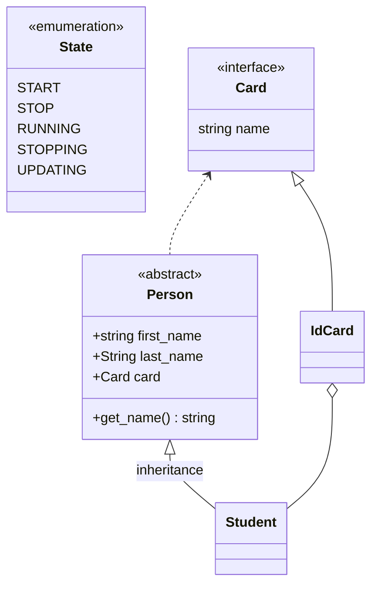
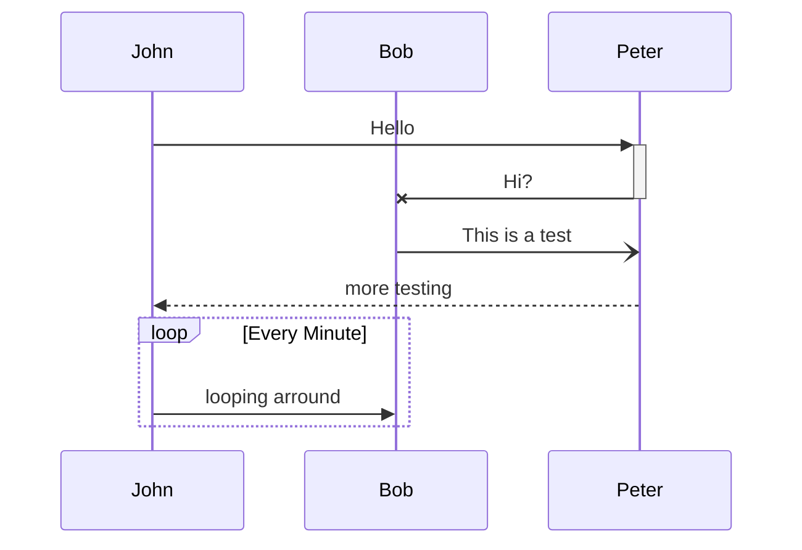
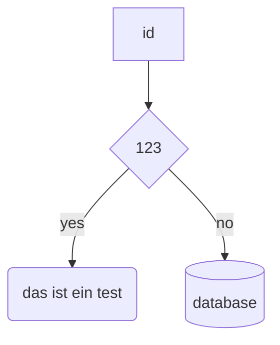

# Mermaid Diagram
how to use mermaid in jetbrains in markdowns,
link https://www.jetbrains.com/go/guide/tips/mermaid-js-support-in-markdown/

## Class Diagram

```mermaid
classDiagram

class Person {
    <<abstract>>
    +string first_name
    +String last_name
    +Card card
    +get_name() string
}

class Student {
    
}

Person <|-- Student: inheritance

class State {
    <<emumeration>>
   START
   STOP
   RUNNING
   STOPPING
   UPDATING
}

class Card  {
    <<interface>>
    string name
}

Card <.. Person

class IdCard {
    
}

Card <|-- IdCard

IdCard o-- Student

```

## Sequence Diagram

```mermaid
sequenceDiagram
participant John
participant Bob
participant Peter

John->>+Peter: Hello
Peter-x-Bob: Hi?
Bob-)Peter: This is a test
Peter-->>John: more testing
loop Every Minute
    John->>Bob: looping arround
end
```

## Flowchart

```mermaid
flowchart
id --> id2{123}
id2 -->|yes| id3(das ist ein test)
id2 -->|no| id4[(database)]
click id2 "https://www.google.de" _blank
```